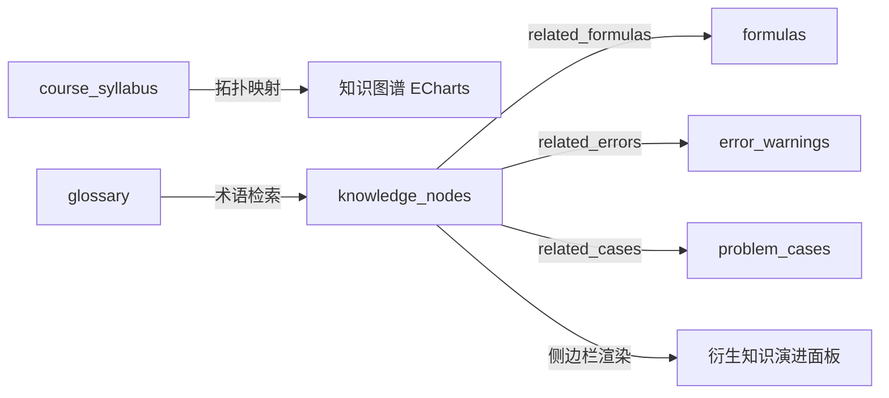

# 《随机信号分析》AI 助教 Clar — 系统设计方案文档

> **版本**: v2.1.1 | **最后更新**: 2026-06-05 | **作者**: DZLiu 团队

---

## 目录

1. [项目背景与目标](#1-项目背景与目标)
2. [系统总体架构](#2-系统总体架构)
3. [模块详细设计](#3-模块详细设计)
   - 3.1 [前端展示层](#31-前端展示层-frontendindexhtml--appjs)
   - 3.2 [后端服务层](#32-后端服务层-backendserverpy)
   - 3.3 [智能体核心层](#33-智能体核心层-coreagent_brainpy)
   - 3.4 [信号计算引擎](#34-信号计算引擎-coresignal_enginepy)
   - 3.5 [知识库数据层](#35-知识库数据层-datasignal_knowledge_basepy)
4. [数据流与交互时序](#4-数据流与交互时序)
5. [信号处理算法设计](#5-信号处理算法设计)
6. [AI 智能体设计](#6-ai-智能体设计)
7. [前端 UI/UX 设计](#7-前端-uiux-设计)
8. [API 接口契约](#8-api-接口契约)
9. [工程创新与设计巧思](#9-工程创新与设计巧思)
10. [部署与运维](#10-部署与运维)

---

## 1. 项目背景与目标

### 1.1 课程背景

《随机信号分析》是电子信息及通信类专业的核心课程，课程涵盖随机过程基本理论、线性系统分析、窄带随机过程及非线性变换等内容。该课程数学抽象程度高、公式推导密集，学生在学习过程中面临以下痛点：

- **概念理解困难**：广义平稳、遍历性、维纳-欣钦定理等概念缺乏直觉化理解途径
- **理论与实践脱节**：教材公式无法直接映射到可交互的信号仿真环境
- **缺乏即时反馈**：传统教学中，学生无法在提出疑问的同时看到参数调整对信号特性的实时影响

### 1.2 设计目标

构建一个 **"感知 — 决策 — 控制"闭环** 的智能教学系统：

| 目标维度 | 具体指标 |
|---------|---------|
| **交互零摩擦** | AI 口令即操作——自然语言指令直接驱动信号生成、参数调整和页面跳转 |
| **知识全覆盖** | 覆盖课程大纲 4 章 × 18 小节 × 50+ 核心知识点，配套公式、题型、错因、术语 |
| **数学可视化** | 9 种信号类型实时生成，6 种图表（时域波形、自相关、互相关、概率密度、幅度谱/PSD/相位谱）动态切换 |
| **处理可验证** | 4 种滤波/估计算法（滑动平均、RC低通、维纳滤波、卡尔曼滤波）全链路可视化 |
| **界面高品质** | 玻璃拟态 + 几何科技背景 + 微动画 + 边缘羽化的沉浸式学术美学 |

---

## 2. 系统总体架构

### 2.1 架构分层图

```
┌────────────────────────────────────────────────────────────────────┐
│                       前端展示层 (Presentation)                      │
│  ┌──────────┐  ┌──────────┐  ┌──────────┐  ┌──────────────────┐  │
│  │ 信号工坊  │  │ 知识图谱  │  │  工具箱   │  │  AI 助教对话面板  │  │
│  │ Plotly.js │  │ ECharts  │  │ Plotly.js │  │  SSE 流式渲染    │  │
│  └──────────┘  └──────────┘  └──────────┘  └──────────────────┘  │
│                    ↕ REST API / SSE (JSON)                         │
├────────────────────────────────────────────────────────────────────┤
│                       后端服务层 (API Gateway)                       │
│           FastAPI + Uvicorn (ASGI) + CORS + Static Mount           │
│  ┌──────────────┐  ┌──────────────┐  ┌──────────────────────┐    │
│  │ 信号生成 API  │  │ 滤波处理 API  │  │ AI 对话 API (SSE)    │    │
│  │ /api/signal/* │  │ /api/signal/* │  │ /api/chat            │    │
│  └──────┬───────┘  └──────┬───────┘  └──────────┬────────────┘    │
├─────────┼──────────────────┼─────────────────────┼────────────────┤
│         ↓                  ↓                     ↓                 │
│                       核心业务层 (Core Logic)                        │
│  ┌────────────────┐  ┌──────────────────────────────────────┐     │
│  │ signal_engine  │  │ agent_brain (SignalAgent)             │     │
│  │ 9种信号生成器   │  │ DeepSeek API 调用 + Function Calling  │     │
│  │ 4种滤波算法    │  │ 5个内置工具函数 + 流式输出             │     │
│  │ 特征分析引擎   │  │ 结构化 JSON 输出 + 动态系统提示词       │     │
│  └────────────────┘  └──────────────────────────────────────┘     │
│                              ↕                                     │
├────────────────────────────────────────────────────────────────────┤
│                       知识数据层 (Knowledge Base)                    │
│  ┌────────────────────────────────────────────────────────────┐   │
│  │ signal_knowledge_base.py                                    │   │
│  │ 课程大纲树 | 知识点卡片 | 公式库 | 题型库 | 错因库 | 术语表 │   │
│  └────────────────────────────────────────────────────────────┘   │
└────────────────────────────────────────────────────────────────────┘
          ↕ HTTPS (OpenAI Compatible SDK)
┌────────────────────────────────────────────────────────────────────┐
│                    外部大语言模型服务 (LLM)                          │
│                    DeepSeek Chat API                                │
└────────────────────────────────────────────────────────────────────┘
```

### 2.2 技术选型总览

| 层级 | 技术栈 | 选型理由 |
|------|--------|---------|
| 前端渲染 | 原生 HTML/CSS/JS | 零构建依赖，便于单文件分发和 ngrok 演示 |
| UI 设计语言 | Glassmorphism (玻璃拟态) | 现代感强，与学术严肃性形成高级反差 |
| 字体 | Plus Jakarta Sans (Google Fonts) | 兼顾中英文的高可读性 |
| 图表 | Plotly.js 2.32 + ECharts 5.5 | Plotly 擅长科学绘图，ECharts 擅长力导向图 |
| 公式 | KaTeX 0.16 | 性能远超 MathJax，毫秒级渲染 |
| Markdown | marked.js 12 | 轻量、GFM 兼容 |
| 后端框架 | FastAPI | 原生 async、自动 OpenAPI 文档、Pydantic 校验 |
| ASGI 服务器 | Uvicorn | 支持 hot-reload、高并发 |
| AI 接入 | OpenAI SDK + DeepSeek API | 兼容性好，支持流式 + Function Calling |
| 数值计算 | NumPy 1.24+ / SciPy 1.10+ | 工业级信号处理生态 |
| 配置管理 | python-dotenv | 安全的 API Key 隔离 |

---

## 3. 模块详细设计

### 3.1 前端展示层 (`frontend/index.html` + `app.js`)

#### 3.1.1 页面结构

系统采用 **三栏 + 底栏** 布局，通过 Tab 导航在主工作区内切换三个功能页面：

```
┌─────────────────────────────────────────────────────────────┐
│                                                              │
│  ┌────────────────────┐ ┌───────────┐ ┌──────────────────┐  │
│  │                    │ │  衍生知识  │ │  AI 助教 Clar    │  │
│  │     主工作区        │ │  演进面板  │ │                  │  │
│  │                    │ │           │ │  聊天消息流       │  │
│  │  信号工坊 (默认)    │ │  (可折叠)  │ │                  │  │
│  │  知识图谱          │ │  基石卡    │ │  ┌────────────┐  │  │
│  │  工具箱            │ │  聚焦卡    │ │  │  输入框     │  │  │
│  │                    │ │  追问链    │ │  └────────────┘  │  │
│  └────────────────────┘ └───────────┘ └──────────────────┘  │
│                                                              │
│  ┌──────────────────────────────────────────────────────────┐│
│  │  底栏：Tab 导航 + 信号参数控制面板                        ││
│  │  [信号工坊] [知识图谱] [工具箱]  型号|信噪比|频率|采样率    ││
│  └──────────────────────────────────────────────────────────┘│
└─────────────────────────────────────────────────────────────┘
```

#### 3.1.2 核心前端状态机

```javascript
const S = { 
    page: 'signal-lab',          // 当前活动选项卡页面
    signalData: null,            // 信号工坊当前生成的时频域数据及特征集
    filteredData: null,          // 滤波器运算后输出的滤噪波形及时频域特征
    filterParams: null,          // 当前滤波器参数
    kalmanParams: null,          // 卡尔曼滤波当前的系统参数
    kalmanData: null,            // 卡尔曼滤波演算生成的运动估计轨迹与误差协方差历史
    radarData: null,             // 雷达仿真产生的二维点云、估计航迹及漏警虚警统计
    radarParams: null,           // 雷达追踪的仿真参数
    currentNode: null,           // 当前关联的知识节点 ID（如 KP_CH3_01）
    graphNode: null,             // 图谱中当前高亮点击的节点名称/原始数据
    allNodes: null,              // 图谱节点缓存
    allLinks: null,              // 图谱连线缓存
    isProgrammaticUpdate: false,  // 防止 AI 修改参数时触发循环生成
    activeControllers: {},        // AbortController 映射表（消息撤回/请求终止用）
    chatHistory: [],             // 当前会话的历史上下文，最大保留 10 轮交互
    aiMode: 'classic'            // 助教交互模式（classic：经典侧边栏对话 | clar-ball：右下角呼吸小精灵）
};
```

#### 3.1.3 关键前端机制

| 机制 | 描述 |
|------|------|
| **SSE 流式渲染** | AI 回复通过 Server-Sent Events 逐字符推送到气泡，同时提取 JSON 元数据驱动后续动作 |
| **KaTeX 异步重排** | 数学公式渲染后触发滚动位置补偿，避免高度跳变导致的视觉闪烁 |
| **Markdown + Math 混合渲染** | 先用正则提取数学块占位，再经 marked.js 处理 Markdown，最后回填数学块并调用 KaTeX |
| **消息撤回机制** | 发送后 5 秒内显示"撤回"按钮，点击后 AbortController 终止请求、清除气泡、恢复输入文本 |
| **自动滚动蒙版** | 聊天容器和知识面板的上下边缘带有 `mask-image` 羽化渐变蒙版 |
| **奈奎斯特守门员** | 信号频率变化时自动校验采样率，低于 $2f_{max}$ 显示红色/橙色警告 |

### 3.2 后端服务层 (`backend/server.py`)

#### 3.2.1 职责划分

后端服务层作为 **API 网关**，不包含业务逻辑，职责包括：

1. **路由注册** — 将 HTTP 请求分发到对应的处理函数
2. **参数校验** — 通过 Pydantic 模型自动验证请求体
3. **数据降采样** — 将高分辨率 NumPy 数组降采样为前端可接受的 JSON 列表
4. **高分辨率插值** — 生成 2000 点的平滑理论曲线用于前端绘图
5. **流式解析** — `JSONReplyStreamParser` 逐字符解析 AI 返回的 JSON 流中的 `reply` 字段
6. **鲁棒回退** — `extract_reply_robust()` 和 `try_parse_json()` 处理截断/格式异常的 AI 输出
7. **静态文件挂载** — 将 `frontend/` 目录挂载到根路径 `/`

#### 3.2.2 Pydantic 数据模型

```python
class SignalParams:       # 信号生成参数
class FilterParams:       # 滤波处理参数
class KalmanParams:       # 卡尔曼仿真参数
class ChatRequest:        # AI 对话请求
class ExplainRequest:     # 知识图谱节点 AI 讲解请求
class LogRequest:         # 前端错误日志上报
```

### 3.3 智能体核心层 (`core/agent_brain.py`)

#### 3.3.1 SignalAgent 类设计

```python
class SignalAgent:
    def __init__(self):
        """初始化 DeepSeek API 客户端"""

    def chat(self, user_message, signal_context, knowledge_context,
             temperature=0.5, require_json=False):
        """同步对话：支持多轮工具调用 + 结构化 JSON 输出"""

    def chat_stream(self, user_message, signal_context, knowledge_context,
                    temperature=0.5, require_json=False):
        """流式对话：逐 chunk 生成器 + 后台工具调用"""

    def get_smart_follow_ups(self, node_title, core_concept,
                              engineering_meaning, count=3):
        """基于知识节点生成启发性追问"""
```

#### 3.3.2 工具调用体系 (Function Calling)

智能体配备 5 个内置工具函数，通过 OpenAI Compatible API 的 `tool_calls` 机制调用：

| 工具名称 | 触发场景 | 数据源 |
|---------|---------|--------|
| `get_knowledge_node(node_id)` | 解释概念、推导公式时 | 知识库节点卡片 |
| `get_glossary(term)` | 查询术语定义时 | 术语符号表 |
| `get_problem_case(case_id)` | 讲解例题时 | 题型卡片 |
| `get_error_warning(err_id)` | 辨析误区时 | 错因卡片 |
| `get_current_signal()` | 分析当前信号特性时 | 前端上行的信号上下文 |

#### 3.3.3 动态系统提示词 (System Prompt) 构建

系统提示词根据当前系统状态动态拼接，包含以下区块：

```
[基础人设] → [知识库节点索引] → [当前信号上下文]
    → [滤波器处理状态] → [卡尔曼仿真状态]
    → [当前讨论知识点] → [行为准则]
    → [结构化 JSON 输出要求（含 generate_signal / run_toolbox 指令规范）]
    → [模糊指令经典值表]
```

#### 3.3.4 输出清洗管线

AI 原始输出经过以下清洗步骤：

```
原始文本 → 移除 XML 工具调用标签 → 移除思考过程句式
         → 移除零宽/不可见字符 → 移除 Emoji
         → 提取 [NODE:xxx] 节点标记 → 输出纯净文本
```

### 3.4 信号计算引擎 (`core/signal_engine.py`)

#### 3.4.1 信号生成器注册表

采用 **策略模式** 设计，所有信号生成器注册在统一字典中：

| 信号类型 | 生成函数 | 数学模型 |
|---------|---------|---------|
| 正弦+白噪声 | `_gen_sine` | $x(t) = \sin(2\pi f_0 t) + n(t)$ |
| 方波+白噪声 | `_gen_square` | $x(t) = \text{sgn}(\sin(2\pi f_0 t)) + n(t)$ |
| 三角波+白噪声 | `_gen_triangle` | 锯齿波 (width=0.5) + 白噪声 |
| 双频正弦+白噪声 | `_gen_dual_tone` | $x(t) = 0.5[\sin(2\pi f_1 t) + \sin(2\pi f_2 t)] + n(t)$ |
| 窄带高斯信号 | `_gen_narrowband` | 白噪声 → FFT → 理想带通 → IFFT |
| 瑞利分布包络 | `_gen_rayleigh` | $R(t) = \sqrt{I^2(t) + Q^2(t)}$，$I,Q$ 为低通正交分量 |
| 线性调频(LFM) | `_gen_lfm` | $x(t) = \sin(2\pi[f_0 t + \frac{k}{2}t^2])$，$k = \frac{f_{end}-f_0}{T}$ |
| 高斯白噪声 | `_gen_gaussian_white_noise` | $x(t) \sim \mathcal{N}(0, 1)$ |
| 一阶马尔可夫过程 | `_gen_markov` | $x[n] = a \cdot x[n-1] + w[n]$，$w \sim \mathcal{N}(0, 1-a^2)$ |

#### 3.4.2 统计特征分析

`analyze_features()` 函数计算以下完整特征集合：

| 分类 | 特征项 | 说明 |
|------|--------|------|
| 一阶统计量 | 均值、方差、标准差、RMS、峰峰值 | 基本幅度描述 |
| 高阶统计量 | 峭度 (Kurtosis) | 分布尖峭程度 |
| 时域相关性 | 自相关函数、互相关函数 | 无偏估计，归一化到时间轴 |
| 频域特性 | 功率谱密度 (Periodogram)、相位谱 | 基于 FFT |
| 概率分布 | PDF 直方图 (50 bins, density=True) | 含纯净信号的高分辨率 PDF |

#### 3.4.3 滤波算法

| 算法 | 实现 | 关键参数 |
|------|------|---------|
| 滑动平均 | `np.convolve(signal, kernel, 'same')` | 窗口大小 $N$ |
| RC一阶低通 | 递推差分方程：$y[n] = y[n-1] + \alpha(x[n] - y[n-1])$ | 截止频率 $f_c$ |
| 维纳滤波 | 频域：$H(\omega) = \frac{G_{ss}}{G_{ss} + G_{nn}}$ | 自适应 |
| 卡尔曼滤波 | 二维状态空间 [位置, 速度] 递推 | 过程噪声 $q$、测量噪声 $\sigma_v$ |

### 3.5 知识库数据层 (`data/signal_knowledge_base.py`)

#### 3.5.1 六位一体知识体系

```
RANDOM_SIGNAL_KB = {
    "course_syllabus": {...},     # 宏观层：4章 × 18小节 → 知识图谱拓扑
    "glossary": [...],            # 术语符号表：X(t), m_X(t), R_X, G_X(ω), WSS
    "knowledge_nodes": {...},     # 知识点卡片：5 个核心节点（WSS、W-K定理、白噪声LTI、维纳、卡尔曼）
    "formulas": {...},            # 公式卡片：5 个核心公式（含 LaTeX）
    "problem_cases": {...},       # 题型卡片：经典例题与解题步骤
    "error_warnings": {...}       # 错因卡片：4 个高频考点误区
}
```

#### 3.5.2 数据关联图



---

## 4. 数据流与交互时序

### 4.1 信号生成闭环

```
用户修改底栏参数 / AI 下发 generate_signal 指令
        ↓
  前端组装 SignalParams JSON
        ↓
  POST /api/signal/generate
        ↓
  signal_engine.generate_signal()    ← 生成纯净信号 + 含噪信号
  signal_engine.analyze_features()   ← 计算完整统计特征
  generate_fine_clean()              ← 高分辨率理论曲线
  _downsample() + interp1d()         ← 降采样 + 三次样条插值
        ↓
  JSON 返回（t, clean, noisy, clean_fine, noisy_fine,
             freqs, spec, autocorr, pdf, psd, phase, features）
        ↓
  前端 Plotly.js 绘制 6 种图表 + 更新统计指标卡片
```

### 4.2 AI 对话时序

```
用户输入问题 / 点击追问按钮 / 点击知识图谱节点
        ↓
  前端构建 ChatRequest（含 signal_context + current_node_id）
        ↓
  POST /api/chat → SSE 流式响应
        ↓
  agent.chat_stream() 启动：
    ├─ 第一轮：DeepSeek 流式 → 检测 tool_calls
    │   ├─ 无工具调用 → 直接逐 chunk yield 文本
    │   └─ 有工具调用 → 收集参数 → 执行工具 → 拼接结果到 messages
    │       └─ 第二轮：带工具结果重新流式生成 → yield 文本
    └─ 流结束
        ↓
  后端 JSONReplyStreamParser 实时解析 reply 字段 → SSE data 推送
  流结束后 extract_reply_robust() 提取完整元数据
        ↓
  前端接收 SSE 事件流：
    ├─ type="text" → 逐字符追加到气泡
    └─ type="metadata" → 提取 reply/quick_questions/suggested_page/
                          generate_signal/run_toolbox/time_analysis_type/
                          freq_analysis_type
        ↓
  前端执行后续动作：
    ├─ generate_signal → 自动填参 + 跳转信号工坊 + 触发生成
    ├─ run_toolbox → 自动填参 + 跳转工具箱 + 触发滤波/卡尔曼
    ├─ suggested_page → 智能页面跳转
    ├─ time/freq_analysis_type → 切换图表视图
    └─ quick_questions → 渲染追问按钮
```

---

## 5. 信号处理算法设计

### 5.1 信噪比控制模型

所有信号类型统一通过 `add_noise_with_snr()` 实现精确的 SNR 控制：

$$P_{signal} = \frac{1}{N}\sum_{n=0}^{N-1} x_{clean}^2[n]$$

$$\text{scale} = \sqrt{\frac{P_{signal}}{10^{SNR_{dB}/10} \cdot P_{noise}}}$$

$$x_{noisy}[n] = x_{clean}[n] + \text{scale} \cdot n[n]$$

### 5.2 卡尔曼滤波状态空间模型

采用经典的匀速运动 + 随机加速度模型：

**状态向量**：$\mathbf{x}_k = [位置, 速度]^T$

**状态转移方程**：

$$\mathbf{x}_{k} = \begin{bmatrix} 1 & \Delta t \\ 0 & 1 \end{bmatrix} \mathbf{x}_{k-1} + \mathbf{w}_k$$

**观测方程**：

$$z_k = \begin{bmatrix} 1 & 0 \end{bmatrix} \mathbf{x}_k + v_k$$

**过程噪声协方差**（随机加速度驱动）：

$$\mathbf{Q} = q \begin{bmatrix} \frac{\Delta t^3}{3} & \frac{\Delta t^2}{2} \\ \frac{\Delta t^2}{2} & \Delta t \end{bmatrix}$$

**递推五步骤**：预测状态 → 预测协方差 → 计算增益 → 更新状态 → 更新协方差

### 5.3 高分辨率波形重建策略

为解决低采样率下波形失真问题，系统采用双轨渲染策略：

| 信号类别 | 重建方法 | 分辨率 |
|---------|---------|--------|
| 确定性周期信号（正弦、方波等） | 数学公式直接计算高密度点 | 2000 点 |
| 随机信号（窄带、瑞利、马尔可夫） | 三次样条插值 `interp1d(kind='cubic')` | 2000 点 |
| PDF 平滑显示 | 10 万点高分辨率 + 随机相位偏移 | 100,000 点 |

---

## 6. AI 智能体设计

### 6.1 智能体输出协议

AI 以严格的 JSON 格式返回结构化数据：

```json
{
    "reply": "详细的文字解答（支持 LaTeX 公式）",
    "new_card": { "title": "新知识点", "core_concept": "核心概念" },
    "quick_questions": ["追问1", "追问2", "追问3"],
    "suggested_page": "signal-lab | knowledge-map | toolbox | none",
    "time_analysis_type": "waveform | autocorr | crosscorr | pdf | null",
    "freq_analysis_type": "amplitude | psd | phase | null",
    "generate_signal": { "signal_type": "...", "freq": ..., ... },
    "run_toolbox": { "operation": "...", "params": { ... } }
}
```

### 6.2 模糊指令智能回填

当用户指令缺少参数时（如"生成一个正弦波"），AI **绝对不会追问**，而是直接使用经典默认值：

| 信号类型 | 默认频率 | 默认采样率 | 默认 SNR | 其他默认值 |
|---------|---------|----------|---------|-----------|
| 正弦+白噪声 | 200 Hz | 10000 Hz | 10 dB | — |
| 窄带 | 200 Hz | 10000 Hz | 10 dB | 带宽 50 Hz |
| 瑞利分布 | 200 Hz | 10000 Hz | 10 dB | 带宽 50 Hz |
| 线性调频(LFM) | 100 Hz | 10000 Hz | 10 dB | 终止 400 Hz |
| 一阶马尔可夫 | — | 10000 Hz | 10 dB | a = 0.9 |

### 6.3 流式 JSON 解析器

`JSONReplyStreamParser` 是一个状态机解析器，能够在 AI 流式输出 JSON 的过程中，实时提取 `reply` 字段的值并逐字符推送前端，支持：

- JSON 转义字符处理（`\\n`, `\\t`, `\\u` Unicode 转义）
- 嵌套引号识别
- 流中断容错

---

## 7. 前端 UI/UX 设计

### 7.1 设计语言：Glassmorphism Ultra

| 设计元素 | CSS 实现 |
|---------|---------|
| **玻璃背景** | `backdrop-filter: blur(25px) saturate(200%)` + 半透明渐变 |
| **双层边框** | `background: ... padding-box, ... border-box` + `border: 1px solid transparent` |
| **悬浮投影** | 三层 `box-shadow`：外阴影 + 内高光 + 内底部暗线 |
| **几何背景** | SVG 六边形/三角形 + 等距三角网格 + 缓慢漂浮旋转动画 |
| **边缘羽化** | `mask-image: linear-gradient(...)` 四向交叉蒙版 |
| **微交互** | `transform: translateY(-6px) scale(1.015)` hover 抬升 + 弹性缓动 |

### 7.2 色彩系统

```css
:root {
    --text:         #1e293b;    /* Slate 800 */
    --text-muted:   #64748b;    /* Slate 400 */
    --accent:       #4f46e5;    /* Indigo 600 */
    --accent-hover: #4338ca;    /* Indigo 700 */
}
```

背景渐变：`linear-gradient(135deg, #f0f4f8, #e2e8f0, #d9e2ec)`

几何装饰色：Indigo (#4f46e5) / Pink (#ec4899) / Cyan (#06b6d4) / Amber (#f59e0b)

### 7.3 聊天气泡设计

| 角色 | 样式特征 |
|------|---------|
| **用户消息** | 右对齐，Indigo 渐变背景，右侧 4px 实色边框，右上圆角 4px |
| **AI 回复** | 左对齐，白色毛玻璃背景，左侧 4px Indigo 边框，左上圆角 4px |
| **撤回按钮** | 半透明玻璃态，5 秒后 `max-width: 0` + `scale(0.7)` 平滑收缩消失 |

### 7.4 输入框设计

- 多行 `<textarea>`，基准高度 56px，最大 120px 自动扩展
- Enter 发送，Shift+Enter 换行
- 发送/撤回后自动重置高度

---

## 8. API 接口契约

### 8.1 信号生成

```
POST /api/signal/generate
Request:  SignalParams { signal_type, freq, fs, snr_db, duration, bandwidth?, freq_end?, markov_a?, freq2? }
Response: { t[], clean[], noisy[], t_fine[], clean_fine[], noisy_fine[],
            freqs[], spec_clean[], spec_noisy[], features{},
            autocorr[], autocorr_lags[], crosscorr[], crosscorr_lags[],
            pdf_x[], pdf_y[], pdf_x_clean[], pdf_y_clean[],
            psd_clean[], psd_noisy[], psd_freqs[],
            phase_clean[], phase_noisy[] }
```

### 8.2 滤波处理

```
POST /api/signal/filter
Request:  FilterParams { ...SignalParams, filter_type, window_size, cutoff_freq }
Response: { filtered[], filtered_fine[], t_fine[], noisy[], noisy_fine[],
            freqs[], spec_original[], spec_filtered[], features{} }
```

### 8.3 卡尔曼仿真

```
POST /api/signal/kalman
Request:  KalmanParams { q, r, v0, duration, fs }
Response: { t[], pos_true[], pos_meas[], pos_est[],
            vel_true[], vel_est[], p_error_pos[], k_gain_pos[], k_gain_vel[] }
```

### 8.4 AI 对话

```
POST /api/chat
Request:  ChatRequest { prompt, signal_context?, current_node_id, graph_node_name }
Response: SSE Stream
          data: { type: "text", content: "逐字符" }
          data: { type: "metadata", code: 200, reply, new_card, quick_questions,
                  suggested_page, generate_signal, run_toolbox,
                  time_analysis_type, freq_analysis_type, node_id }
```

### 8.5 知识图谱

```
GET  /api/knowledge/graph           → { nodes[], links[] }
GET  /api/knowledge/node/{node_id}  → { title, chapter, core_concept, engineering_meaning, formulas[], errors[] }
GET  /api/knowledge/quick-questions/{node_id}?count=3  → { code, questions[] }
POST /api/knowledge/ai-explain      → { reply, title, chapter, section, is_dynamic }
```

---

## 9. 工程创新与设计巧思

### 巧思一：零阻碍的"感知-决策-控制"闭环

传统 AI 助教只能"说"不能"做"。本系统通过 JSON 指令协议，将 AI 的自然语言理解直接映射为前端操作：参数填充 → 页面跳转 → 触发计算 → 图表渲染，真正实现"**口令即操作**"。

### 巧思二：交互式奈奎斯特守门员

采样率输入框实时校验 Shannon-Nyquist 条件。低于 $2f_{max}$ 时红色警告，$2$-$4$ 倍临界带时橙色提示，将死板的采样定理转化为直觉化的互动教具。

### 巧思三：高保真波形双轨重建

后端同时返回低采样离散点和 2000 点高分辨率理论曲线。前端叠加绘制平滑蓝色连续波形与红色离散采样标记，严谨展示"模拟连续信号 → 采样离散化"的物理过程。

### 巧思四：边缘羽化流光蒙版

聊天容器、知识面板和知识图谱的边缘采用 CSS `mask-image` + `mask-composite: intersect` 四向交叉渐变蒙版。节点飘向边界时自然渐隐，消除生硬截断，完美兼容 Safari 和 ngrok 穿透环境。

### 巧思五：双梯度 border-box 悬浮美学

卡片边框采用 `padding-box` + `border-box` 双重渐变背景配合 `transparent` 边框，实现边框线条本身的透明度渐变。配合精密的 `translateY` 抬升 + 三层漫反射投影，赋予学术界面物理级的拟物质感。

### 巧思六：流式 JSON 实时解析器

AI 以 JSON 格式返回结构化数据。为避免等待完整 JSON 才能显示文字，我们设计了 `JSONReplyStreamParser` 状态机——在 JSON 流式到达的过程中，实时逐字符提取 `reply` 字段推送前端，用户感知的首字延迟趋近于零。

### 巧思七：消息撤回与请求取消

基于 `AbortController` 实现 5 秒内消息撤回。撤回时终止 HTTP 请求、清除 DOM 气泡、恢复输入文本。撤回按钮退场动画采用 `max-width: 0` + `scale(0.7)` + `opacity: 0` 三维收缩过渡，气泡自然扩展补位，无任何布局跳动。

### 巧思八：灵动避让小精灵与双模式机制

本系统首创了双交互模式：**Classic (经典侧边栏对话)** 与 **Clar-ball (悬浮避让圆球)**。
1. **会呼吸的状态机小球**：在 Clar-ball 模式下，AI 聊天面板默认折叠。小球直属 `body` 节点，Classic 状态为绿色呼吸，Listening 为蓝色呼吸，Thinking 为紫色高频呼吸，Action 为高亮绿呼吸。
2. **2D 真空吸入收缩特效**：双击小球或切回 Classic 时，聊天面板 `#ai-panel` 的高宽同时 transition 渐变至 $0$ 并伴随 `scale(0)` 和淡出，实现柔顺优雅的真空吸入动画。
3. **飞向鼠标与动画回归**：小球通过 `getBoundingClientRect()` 计算绝对起始坐标，并配合强制重绘（`void toggle.offsetWidth`），在悬停感知时顺滑飞向鼠标位置；感知结束或双击归位时，在 0.8s 飞行周期内平滑游回右下角初始锚定点，最后彻底移除内联定位样式。

### 巧思九：全场景屏幕感知与课程脑图 Canvas 触控

通过遥测感知层 `telemetry.js`，系统实现了全场景无死角的信息提取：
1. **脑图 Canvas 物理节点悬停**：通过对 ECharts 脑图 canvas 实例注册事件，捕获当前节点信息与视口坐标，并在移入时触发小精灵变色呼吸并飞跃至脑图节点旁，极大地强化了理论知识的探索互动性。
2. **Plotly 时频域图线深度提取**：根据当前选中的时域/频域子选项卡及信号类型，动态解析元数据，使 AI 获悉用户正在具体观察哪一幅波形（如自相关函数或幅度谱）。
3. **黑盒兜底语义映射**：对于没有特殊元数据标记的普通文本、指标卡片与输入标签，通过 DOM 树向上回溯和自动文本拼装，生成黑盒兜底描述。

### 巧思十：主动物理缺陷诊断与 Proactive Card

小精灵并非安静悬浮，它集成了后台自省机制：
1. **自动物理冲突评估**：系统在每次仿真计算结束后默默调用后台 `/api/chat/proactive`，评估是否存在 Shannon-Nyquist 混叠、低通滤波器截止频率太高/太低、卡尔曼 Q/R 参数过于极端、雷达虚警漏警太高等情况。
2. **主动式卡片通知 (Proactive Card)**：如果检测到物理异常，小球将自动跳转为高频紫光呼吸，并在左侧弹出磨砂浮光卡片。点击“查看诊断建议”即可自动滑出侧边栏，展现 AI 的具体错误剖析与优化路线。

---

## 10. 部署与运维

### 10.1 本地开发

```bash
pip install -r requirements.txt
# 编辑 .env 设置 DEEPSEEK_API_KEY
python main.py
# 浏览器访问 http://localhost:8001
```

### 10.2 公网演示 (ngrok)

```bash
ngrok http 8001
# 复制生成的 https://*.ngrok-free.app 链接分享给评审老师
```

### 10.3 依赖清单

```
fastapi>=0.104.0
uvicorn[standard]>=0.24.0
numpy>=1.24.0
scipy>=1.10.0
openai>=1.0.0
pydantic>=2.0.0
python-dotenv>=1.0.0
```

### 10.4 环境变量

| 变量名 | 说明 | 示例 |
|--------|------|------|
| `DEEPSEEK_API_KEY` | DeepSeek API 密钥 | `sk-xxxxxxxxxxxxxxxx` |

---

> **文档结束** — 本设计方案文档全面覆盖了系统架构、模块设计、算法实现、交互逻辑、视觉设计和工程创新，可作为课程答辩的核心技术支撑材料。
