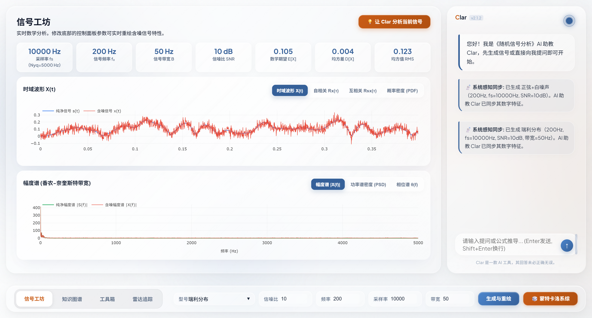
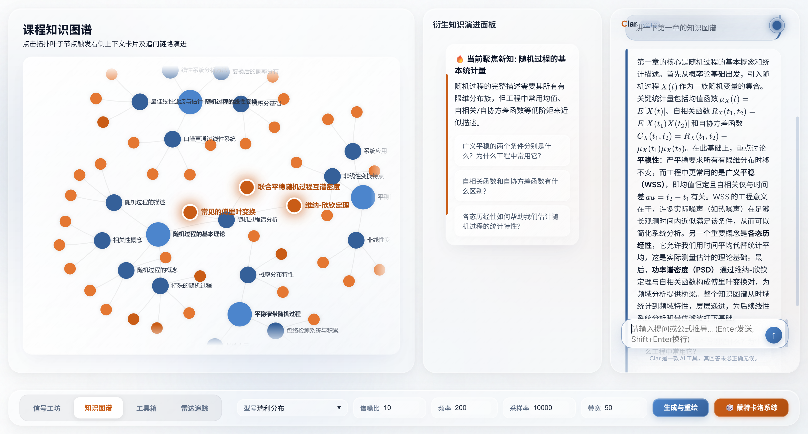
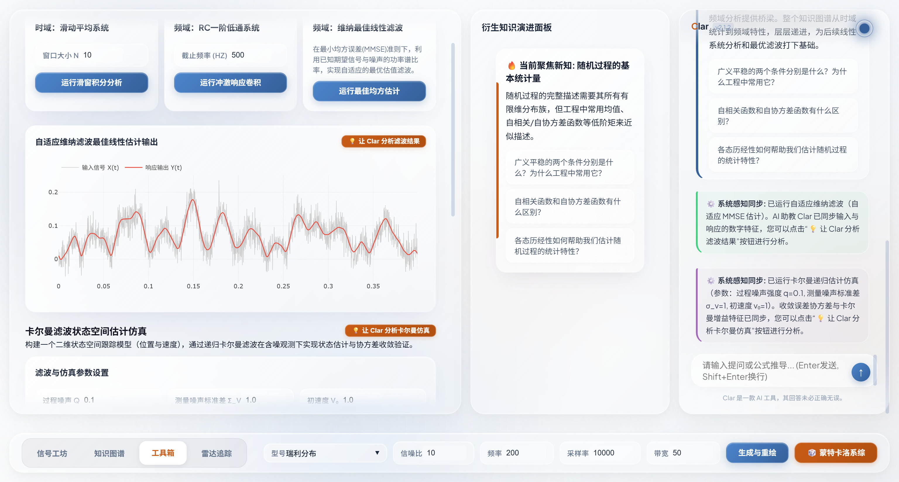

📘 《随机信号分析》智能体 Clar (Signal Analysis Agent Clar) 开发文档

## 1. 项目概述

本项目旨在开发一个具备交互式分析能力和多维知识映射的"随机信号处理智能体"。项目严格对标《随机信号分析》课程考核要求，完整实现"信号采集/生成 -> 预处理与特征分析 -> 智能匹配与滤波"的感知-决策-控制链路。在此基础上，通过大语言模型（LLM）和可视化前端，提供直观的知识图谱交互与公式推导演示。

## 📸 系统预览 (Screenshots)

> **💡 截图占位符**：请在此处替换为系统的实际运行截图，以展示强大的全栈功能与极具未来感的玻璃拟态 UI。
> *(建议将截图文件放入 `docs/assets/` 或项目根目录下的 `assets/` 文件夹中)*


*图 1：系统主界面，展示多维信号波形、频谱渲染及右侧的主动式 AI 助教交互面板。*


*图 2：全景式力导向知识图谱，随底层物理参数的调整实时产生视觉拓扑联动。*


*图 3：维纳滤波去噪与卡尔曼滤波状态估计（预测-更新迭代）动态仿真效果。*


## 2. 技术栈架构

| 层级 | 技术 | 说明 |
|------|------|------|
| 开发语言 | Python 3.10+ | 后端核心逻辑 |
| Web 框架 | FastAPI | REST API + SSE 流式响应 |
| ASGI 服务 | Uvicorn | 高性能异步服务器 |
| 前端 | 原生 HTML/CSS/JS | 玻璃拟态（Glassmorphism）+ 几何科技背景 |
| 图表渲染 | ECharts 5.5 + Plotly.js 2.32 | 知识图谱力导向布局 + 波形/频谱图 |
| 公式渲染 | KaTeX 0.16 | LaTeX 数学公式前端渲染 |
| Markdown | marked.js 12 | AI 回复的富文本渲染 |
| AI 接入 | DeepSeek API (OpenAI SDK) | 流式对话 + Function Calling 工具调用 |
| 信号计算 | NumPy + SciPy | 时域/频域分析、滤波算法 |
| 环境配置 | python-dotenv | .env 文件管理 API Key |

## 3. 核心目录与文件说明 (Directory Structure)

为了让其他开发者和评审老师能快速看懂代码库，以下是对整个开源项目结构的详细说明：

```text
Clar-AI-Agent/
├── 🏁 核心入口点
│   ├── main.py                         # 服务端启动入口（使用 uvicorn 挂载 FastAPI）
│   ├── requirements.txt                # 📦 Python 运行依赖库清单
│   ├── .env.example                    # 🔑 环境变量模板（为了保护隐私，请依据此文件在本地新建 .env）
│   └── .gitignore                      # 🛡️ Git 忽略配置（确保 API Key 和缓存不被上传）
│
├── 📖 官方技术文档 (Documentation)
│   ├── README.md                       # 🏠 项目主页自述文件（本文件）
│   ├── user_guide.md                   # 📘 详细的用户操作与实验手册
│   ├── design_document.md              # 📐 底层系统架构设计方案说明书
│   ├── ai_assistant_capabilities.md    # 🤖 主动式 AI 助教核心能力深度剖析
│   └── docs/                           # 📂 附加的架构拓扑图与更新日志存放区
│
├── 🧠 核心业务层 (Core Engine)
│   ├── core/                           
│   │   ├── agent_brain.py              # AI 大脑中枢：负责 DeepSeek 意图识别、函数调用与流式通讯
│   │   └── signal_engine.py            # 信号引擎核心：底层数学运算、特征提取与滤波器矩阵解算
│   └── data/                           
│       └── signal_knowledge_base.py    # 📚 六位一体的本地化静态图谱知识库
│
├── 🌐 网络路由层 (API Backend)
│   └── backend/                        
│       └── server.py                   # FastAPI RESTful 接口与 SSE 流式路由定义
│
├── 🎨 前端展现层 (Frontend & UI)
│   └── frontend/                       
│       ├── index.html                  # 玻璃拟态风格的主页面入口
│       └── js/                         # 模块化前端架构
│           ├── state.js                # 全局状态管理机 (State Machine)
│           ├── ui.js                   # DOM 交互与动效控制引擎
│           ├── charts.js               # ECharts 图谱与 Plotly 波形双引擎渲染模块
│           ├── chat.js                 # SSE 流式问答渲染器与卡片调度器
│           └── telemetry.js            # 🕵️ 前端隐式遥测模块（收集用户操作上下文）
│
└── 🛠️ 开发与环境配置 (Config)
    ├── .claude                         # AI 编程助手上下文配置文件（可忽略）
    └── .vscode                         # VSCode 编辑器推荐的工作区配置（可忽略）
```

## 4. 核心工作流 (Workflow)

本项目遵循 **感知 — 决策 — 控制** 闭环逻辑：

**感知 (Perception) [输入端]**
- UI 层：用户调整底栏参数（信号类型、频率、SNR、采样率）或输入自然语言指令
- 底层：`signal_engine.py` 生成纯净信号 + 噪声，计算完整统计特征

**决策 (Decision) [大脑端]**
- 特征提取：`signal_engine.py` 自动计算均值、方差、RMS、峰峰值、峭度、自相关、互相关、PSD、PDF
- 意图匹配：`agent_brain.py` 调用 DeepSeek API，通过 Function Calling 精准检索知识库
- 指令解析：AI 输出结构化 JSON，包含 `generate_signal` / `run_toolbox` 执行指令

**控制 (Control) [输出端]**
- 自动执行：前端解析 AI 指令 → 自动填参 → 页面跳转 → 触发计算 → 图表渲染
- UI 反馈：知识卡片联动更新，公式 + 避坑指南 + 智能追问按钮
- 消息管理：5 秒撤回窗口、AbortController 请求取消、平滑退场动画

## 5. API 端点一览

| 方法 | 路径 | 说明 |
|------|------|------|
| POST | `/api/signal/generate` | 生成信号（9 种类型：正弦、方波、三角波、双频、窄带、瑞利、LFM、白噪声、马尔可夫） |
| POST | `/api/signal/filter` | 滤波处理（滑动平均、RC 低通、维纳滤波） |
| POST | `/api/signal/kalman` | 卡尔曼滤波状态空间估计仿真 |
| POST | `/api/chat` | AI 对话（SSE 流式输出 + 结构化 JSON 元数据） |
| POST | `/api/chat/proactive` | 主动 AI 诊断评估（用于分析系统物理参数异常并推送建议卡片） |
| GET | `/api/knowledge/graph` | 知识图谱拓扑数据（节点 + 连线） |
| GET | `/api/knowledge/node/{id}` | 获取知识节点详情（含关联公式、错因） |
| GET | `/api/knowledge/quick-questions/{id}` | AI 生成启发性追问问题 |
| POST | `/api/knowledge/ai-explain` | AI 生成知识节点/章节/小节的专业讲解 |
| POST | `/api/log` | 前端错误日志上报 |

## 6. 快速启动

```bash
# 1. 安装依赖
pip install -r requirements.txt

# 2. 配置 API Key
# 编辑 .env 填入 DEEPSEEK_API_KEY=sk-xxx

# 3. 启动服务
python main.py

# 4. 打开浏览器
# http://localhost:8001
```

## 7. 文档索引

| 文档 | 内容 |
|------|------|
| `README.md` | 项目概述、目录结构、快速启动（本文件） |
| `user_guide.md` | **用户使用手册**：界面操作指南、功能详解、AI 指令示例、FAQ |
| `design_document.md` | 系统设计方案：架构分层、模块设计、数据流、算法、API 契约、工程创新 |
| `ai_assistant_capabilities.md` | AI 助教功能详细描述：信号生成、工具箱控制、知识图谱、情境感知对话、设计巧思 |
